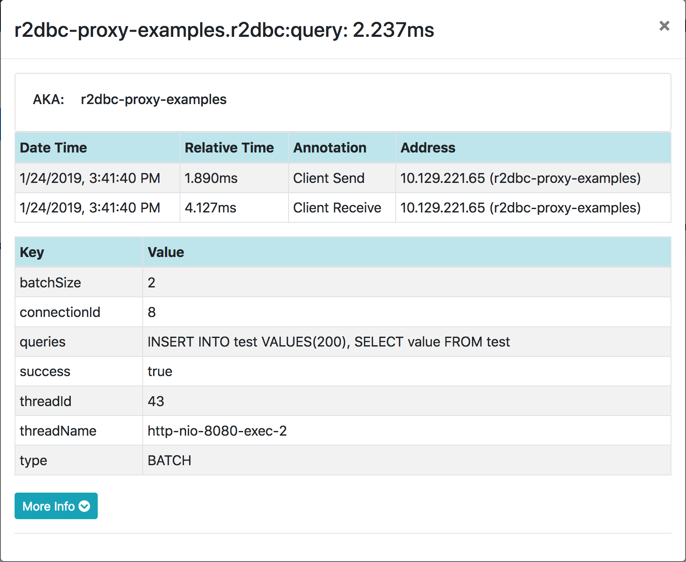

//TODO: move to top
:datasource-proxy: https://github.com/ttddyy/datasource-proxy:
:slow-query-doc: https://ttddyy.github.io/datasource-proxy/docs/current/user-guide/#_slow_query_logging_listener

:r2dbc-proxy-samples: https://github.com/ttddyy/r2dbc-proxy-examples
:TracingExecutionListener: https://github.com/ttddyy/r2dbc-proxy-examples/blob/master/listener-example/src/main/java/io/r2dbc/examples/TracingExecutionListener.java
:MetricsExecutionListener: https://github.com/ttddyy/r2dbc-proxy-examples/blob/master/listener-example/src/main/java/io/r2dbc/examples/MetricsExecutionListener.java


[[use-cases]]
= Use cases

[[use-cases_query-logging]]
== Query logging

When `Batch#execute()` or `Statement#execute()` executes queries, registered proxy listeners receive query callbacks,
`[before|after]Query` methods with `QueryExecutionInfo` parameter.
This parameter contains contextual information about the query execution, such as query string, execution type, bindings, execution time, etc.

With the `QueryExecutionInfoFormatter`, which converts `QueryExecutionInfo` to `String`, users can easily
perform query logging.

.Sample Output (wrapped for display purpose)
[source,sql]
----
# Statement with no bindings
#
Thread:reactor-tcp-nio-1(30) Connection:1
Transaction:{Create:1 Rollback:0 Commit:0}
Success:True Time:34
Type:Statement BatchSize:0 BindingsSize:0
Query:["SELECT value FROM test"], Bindings:[]

# Batch query
#
Thread:reactor-tcp-nio-3(32) Connection:2
Transaction:{Create:1 Rollback:0 Commit:0}
Success:True Time:4
Type:Batch BatchSize:2 BindingsSize:0
Query:["INSERT INTO test VALUES(200)","SELECT value FROM test"], Bindings:[]

# Statement with multiple bindings
#
Thread:reactor-tcp-nio-1(30) Connection:3
Transaction:{Create:1 Rollback:0 Commit:0}
Success:True Time:21
Type:Statement BatchSize:0 BindingsSize:2
Query:["INSERT INTO test VALUES ($1,$2)"], Bindings:[(100,101),(200,null(int))]
----

[[use-cases_query-logging_sample-configuration]]
=== Sample Configuration

Query logging can be achieved by logging executed query information on after-query callback.
This can be done in the **before** query callback(`beforeQuery`); however, some attributes are only
available in the **after** query callback(`afterQuery`) such as execution time, successfully executed,
result count, etc.

`QueryExecutionInfoFormatter`, which converts `QueryExecutionInfo` to `String`, can be used
out of the box to generate log statements.

You could use `QueryExecutionInfoFormatter`, which converts `QueryExecutionInfo` to `String`, to prepare
log statements.

[source,java]
----
QueryExecutionInfoFormatter formatter = QueryExecutionInfoFormatter.showAll();

ConnectionFactory proxyConnectionFactory =
  ProxyConnectionFactory.builder(connectionFactory)    // wrap original ConnectionFactory
                                                       // on every query execution
    .onAfterQuery(execInfo ->
      System.out.println(formatter.format(execInfo)))  // convert & print out to sysout
    .build();
----

[[use-cases_slow-query-detection]]
== Slow Query Detection

There are two types of slow query detection.

- Detect slow query *AFTER* query has executed. (non-preemptive)
- Detect slow query *WHILE* query is running. (preemptive)

Former is simple. On `afterQuery` callback, check the query execution time.
If it took more than the threshold, perform an action such as logging, send notification, etc.

To perform an action _while_ query is still in execution, and it has passed the threshold time, one implementation
is to create a watcher that checks running queries and notify ones exceeded the threshold.
In {datasource-proxy}[datasource-proxy], {slow-query-doc}[`SlowQueryListener` is implemented in this way].

[[use-cases_slow-query-detection_sample-configuration]]
=== Sample Configuration (Non-preemptive)

On after query execution, check whether the query execution time has exceeded the threshold
time, then perform any action.

[source,java]
----
Duration threshold = Duration.of(...);

ConnectionFactory proxyConnectionFactory =
  ProxyConnectionFactory.builder(connectionFactory)  // wrap original ConnectionFactory
    .onAfterQuery(execInfo -> {
       if(threshold.minus(execInfo.getExecuteDuration()).isNegative()) {
         // slow query logic
       }
    })
    .build();
----

[[use-cases_method-tracing]]
== Method Tracing

When any methods on proxy classes(`ConnectionFactory`, `Connection`, `Batch`, `Statement`, or `Result`)
are called, listeners receive callbacks on before and after invocations.

Below output simply printed out the method execution information(`MethodExecutionInfo`)
at each method invocation.
Essentially, this shows interaction with R2DBC SPI.

*Sample: Execution with transaction:*

[source,sql]
----
  1: Thread:34 Connection:1 Time:16  PostgresqlConnectionFactory#create()
  2: Thread:34 Connection:1 Time:0  PostgresqlConnection#createStatement()
  3: Thread:34 Connection:1 Time:0  ExtendedQueryPostgresqlStatement#bind()
  4: Thread:34 Connection:1 Time:0  ExtendedQueryPostgresqlStatement#add()
  5: Thread:34 Connection:1 Time:5  PostgresqlConnection#beginTransaction()
  6: Thread:34 Connection:1 Time:5  ExtendedQueryPostgresqlStatement#execute()
  7: Thread:34 Connection:1 Time:3  PostgresqlConnection#commitTransaction()
  8: Thread:34 Connection:1 Time:4  PostgresqlConnection#close()
----

[[use-cases_sample-configuration]]
=== Sample Configuration

At each invocation of methods, perform action such as printing out the invoked method,
create a span, or update metrics.

`MethodExecutionInfoFormatter` is used to generate log string.

[source,java]
----
MethodExecutionInfoFormatter methodExecutionFormatter = MethodExecutionInfoFormatter.withDefault();

ConnectionFactory proxyConnectionFactory =
  ProxyConnectionFactory.builder(connectionFactory)  // wrap original ConnectionFactory
    // on every method invocation
    .onAfterMethod(execInfo ->
      System.out.println(formatter.format(execInfo)))  // print out method execution (method tracing)
    .build();
```
----

[[use-cases_metrics]]
== Metrics

Similar to the distributed tracing, on every callback, any obtained information can update metrics.

For example:

- Number of opened connections
- Number of rollbacks
- Method execution time
- Number of queries
- Type of query (SELECT, DELETE, ...)
- Query execution time
- etc.

[[use-cases_metrics_sample-implementation]]
=== Sample Implementation

{MetricsExecutionListener}[MetricsExecutionListener] populates following metrics:

- Time took to create a connection
- Commit and rollback counts
- Executed query count
- Slow query count

In addition, this listener logs slow queries.

.Connection metrics on JMX
image::images/metrics-jmx-connection.png[Connection JMX]


.Query metrics on JMX
image::images/metrics-jmx-query.png[Query JMX]

.Transaction metrics on actuator (`/actuator/metrics/r2dbc.transaction`)
image::images/metrics-actuator-connection.png[Transaction Actuator]


[[use-cases_distributed-tracing]]
== Distributed Tracing

Using before and after callbacks with contextual information, it can easily construct tracing spans.

[[use-cases_distributed-tracing_sample-implementation]]
=== Sample implementation

{TracingExecutionListener}[TracingExecutionListener]

.Tracing
image::images/zipkin-tracing-rollback.png[Tracing]

.Connection Span
image::images/zipkin-span-connection.png[Connection Span]

.Query Span


[[use-cases_assertion-verification]]
== Assertion/Verification

By inspecting invoked methods and/or executed queries, you can verify the target logic has performed
as expected.

For example, by keeping track of connection open/close method calls, connection leaks can be
detected or verified.

Another example is to check group of queries are executed on the same connection.
This could verify the premise of transaction - queries need to be performed on the same
connection in order to be in the same transaction.

[[use-cases_own-action]]
== Own Action (Custom Listener)

Users can write own callback logic that performs any actions, such as audit logging, sending
notifications, calling external system, etc.

[[use-cases_own-action_implementing-custom-listener]]
=== Implementing custom listener

In order to create a custom listener, simply implement `ProxyExecutionListener` or `ProxyMethodExecutionListener`
interface.

[source,java]
----
static class MyListener implements ProxyMethodExecutionListener {
	@Override
	public void afterCreateOnConnectionFactory(MethodExecutionInfo methodExecutionInfo) {
		System.out.println("connection created");
	}
}
----
